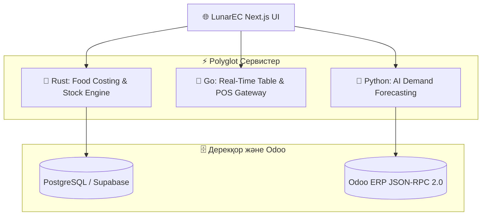

# 🌙 LunarEC — Polyglot Open-Source CRM & ERP Suite

<p align="center">
  
  <a href="https://github.com/BekbolatBolebay/LunarEC/actions">
    
  </a>
  
</p>

<p align="center">
  
  
  
  
  
</p>

---

## 📖 Жоба Туралы (About LunarEC)

**LunarEC** — бұл **4 түрлі бағдарламалау тілінің (TypeScript, Rust, Go, Python)** ең мықты тұстарын біріктірген, Odoo 17/18 үлгісіндегі заманауи **Polyglot Monorepo** кәсіпорындық CRM & ERP платформасы.

---

## 🧩 4 Тілдік Модульдер Архитектурасы (Polyglot Matrix)

| Қабат / Модуль | Қолданылған Тіл | Мақсаты және Атқаратын Қызметі |
|---|---|---|
| 🌐 **Frontend & Odoo Shell** | **TypeScript (Next.js 14 + Tailwind)** | Odoo 17 стиліндегі Kanban тақтасы, App Switcher, Chatter және интерактивті UI. |
| 🦀 **`crates/stock-engine`** | **Rust (Edition 2021)** | Қоймадағы 10 000+ ингредиенттің өзіндік құнын (BOM/COGS) микросекундта есептейтін ультра-жылдам ядро. |
| 🐹 **`services/pos-gateway`** | **Go (Golang 1.22+)** | Үстелдер мен кассалық оқиғаларды миллисекундта синхрондайтын жеңіл желілік шлюз. |
| 🐍 **`services/ai-analytics`** | **Python 3.12+** | Мәзір сатылымын болжау (Demand Forecasting) және Odoo JSON-RPC байланысы. |

---

## 🏗️ Архитектуралық Диаграмма



---

## 🚀 Бір Командамен Барлық 4 Тілді Тексеру (Polyglot Test)

Барлық 4 тілдің (TypeScript, Rust, Python, Go) кодтарын жинап, unit-тестілерін бірден өткізу үшін:

```bash
npm run test:polyglot
```

**Нәтижесінде:**
* 🌐 `Next.js 14` ➔ Compiled successfully
* 🦀 `Rust cargo test` ➔ 2 passed, 0 failed (0.00s)
* 🐍 `Python unittest` ➔ 3 passed (0.000s)
* 🐹 `Go test` ➔ PASS (0.002s)

---

## 📂 Жоба Каталогы

```
LunarEC/
├── .github/workflows/ci.yml       ← 4 тілді қатар тексеретін GitHub Actions
├── app/                           ← TypeScript / Next.js веб қолданбасы
├── components/odoo/               ← Odoo стильдегі UI компоненттері
├── crates/
│   └── stock-engine/              ← 🦀 RUST: Қойма мен калькуляция ядросы
│       ├── Cargo.toml
│       └── src/main.rs
├── services/
│   ├── pos-gateway/               ← 🐹 GO: Желілік POS шлюзі
│   │   ├── go.mod
│   │   ├── main.go
│   │   └── main_test.go
│   └── ai-analytics/              ← 🐍 PYTHON: AI сұранысты болжау
│       ├── analytics.py
│       └── test_analytics.py
├── CRM/                           ← SQL схемалар және CRM API
├── ERP/                           ← Рецептура және Odoo интеграциясы
├── package.json
└── LICENSE                        ← MIT License
```

---

## 📄 Лицензия

MIT License © 2026 LunarNT Team.
Барлық әзірлеушілер мен қауымдастық мүшелері өз үлесін қоса алады! 🚀

### 🚀 Architecture Overview
LunarEC uses an event-driven polyglot architecture:
- Next.js Web Dashboard
- Rust In-Memory FIFO/LIFO Engine
- Go POS WebSocket Stream
- Python Predictive Analytics
