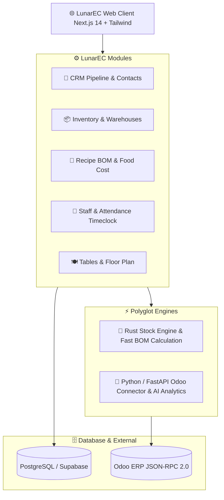

# 🌙 LunarEC — Modular Open-Source CRM & ERP Suite

<p align="center">
  
  
  
  
  
  
  
</p>

---

## 📖 Жоба Туралы (About LunarEC)

**LunarEC (Lunar Enterprise Core / Cloud)** — бұл әлемдегі ең танымал кәсіпорындық **Odoo 17/18** жүйесінің архитектуралық және функционалдық қағидаттарына сүйене отырып жасалған, заманауи, жеңіл және модульдік **CRM және ERP платформасы**.

Мейрамханалар (HoReCa), сауда орталықтары мен бөлшек сауда кәсіпорындарының барлық ресурстарын, сату воронкасын, қойма қалдықтарын және кадрлық есебін бір әмбебап интерфейсте біріктіреді.

---

## 🌟 Басты Мүмкіндіктері (Key Features)

### 1. 📱 Odoo App Launcher (9-Dots Grid)
* Жоғарғы сол жақтағы 9-нүктелі батырма арқылы кез-келген қосымшаға бір сәтте ауысу.
* Модульдік архитектура: қажетті қосымшаларды ғана іске қосу мүмкіндігі.

### 2. 🎯 CRM & Сату Құбыры (Pipeline)
* **Kanban тақтасы:** `Жаңа Лидтер` ➔ `Квалификация` ➔ `Ұсыныс` ➔ `Жеңіс/Келісім` ➔ `Ұтылыс`.
* Кезеңдер бойынша жалпы сомалардың автоматты есебі (₸), басымдылық жұлдыздары (★) және бір шертумен жылжыту.
* **Odoo Chatter:** Клиентпен сөйлесу жазбалары (`Log note`), жоспарланған қоңыраулар (`Schedule activity`) және хронологиялық тарих.

### 3. 📦 Қойма & Инвентаризация (Inventory ERP)
* Шикізат және дайын өнім қалдықтары, критикалық минимум шегі және автоматты дефицит дабылдары.
* Қозғалыс журналы: Кіріс, шығыс, списание.

### 4. 🧾 Технологиялық Карталар & BOM (Manufacturing)
* Мәзірдегі әрбір тағамның ингредиенттік нормасы.
* Нақты уақыттағы **COGS (өзіндік құн)** және таза маржа калькуляциясы.
* Тапсырыс орындалған сәтте қоймадан автоматты түрде ингредиенттерді шегеру (Auto-deduction).

### 5. 👷 Кадрлар & Жұмыс Уақытының Табелі (HR & Attendance)
* Қызметкерлер тізімі, рөлдері және сағаттық мөлшерлемесі.
* Odoo стиліндегі жылдам **Check-in / Check-out** тайм-трекері.

### 6. 🔄 Odoo JSON-RPC 2.0 Сыртқы Интеграциясы
* Нақты сыртқы Odoo серверіне тікелей қосылу, қалдықтарды синхрондау және сату тапсырыстарын (`sale.order`) автоматты экспорттау.

---

## 🏗️ Архитектура (Polyglot Monorepo Roadmap)



---

## 🚀 Жылдам Іске Қосу (Quick Start)

### 1. Репозиторийді клондау:
```bash
git clone https://github.com/parkman/LunarEC.git
cd LunarEC
```

### 2. Тәуелділіктерді орнату:
```bash
npm install
```

### 3. Әзірлеуші серверін қосу:
```bash
npm run dev
```

Браузерде ашыңыз: **[http://localhost:3005](http://localhost:3005)** 🎉

### 4. Жинақтау (Production Build):
```bash
npm run build
npm start
```

---

## 📂 Жоба Құрылымы

```
LunarEC/
├── .github/workflows/ci.yml       ← GitHub Actions CI (Автоматты тест және тексеру)
├── app/                           ← Next.js App Router
│   ├── layout.tsx                 ← Бас лейаут, қаріптер, провайдерлер
│   ├── page.tsx                   ← Басты Odoo CRM/ERP экраны
│   └── globals.css                ← Odoo 17 фирмалық дизайн жүйесі
├── components/odoo/               ← Odoo стильдегі модульдік UI
│   ├── OdooNavbar.tsx             ← Жоғарғы әмбебап басқару панелі
│   ├── OdooAppLauncherModal.tsx   ← 9-нүктелі басты қосымшалар мәзірі
│   ├── OdooKanbanBoard.tsx        ← Сату құбыры және табель тақтасы
│   ├── OdooListView.tsx           ← Кестелік көрініс
│   ├── OdooFormModal.tsx          ← Жазба формасы және Odoo Chatter
│   ├── OdooSyncModal.tsx          ← Odoo JSON-RPC 2.0 байланыс тесті
│   ├── OdooAnalyticsView.tsx      ← Қаржылық түсім графиктері
│   └── OdooCreateModal.tsx        ← Жаңа жазба құру терезесі
├── lib/
│   ├── app-context.tsx            ← Жаһандық күй және тілдер (KZ/RU)
│   ├── store.ts                   ← CRM, Қойма, Кадрлар деректер қоры
│   └── i18n.ts                    ← Көптілділік модулі
├── CRM/                           ← Supabase SQL миграциялары және CRM API
├── ERP/                           ← Қойма, BOM, HR және Odoo интеграциялары
├── LICENSE                        ← MIT License
└── package.json
```

---

## 📄 Лицензия (License)

Бұл жоба **[MIT](LICENSE)** лицензиясы бойынша ашық код түрінде таратылады.
Барлық әзірлеушілер мен қауымдастық мүшелері өз үлесін қоса алады! 🚀
